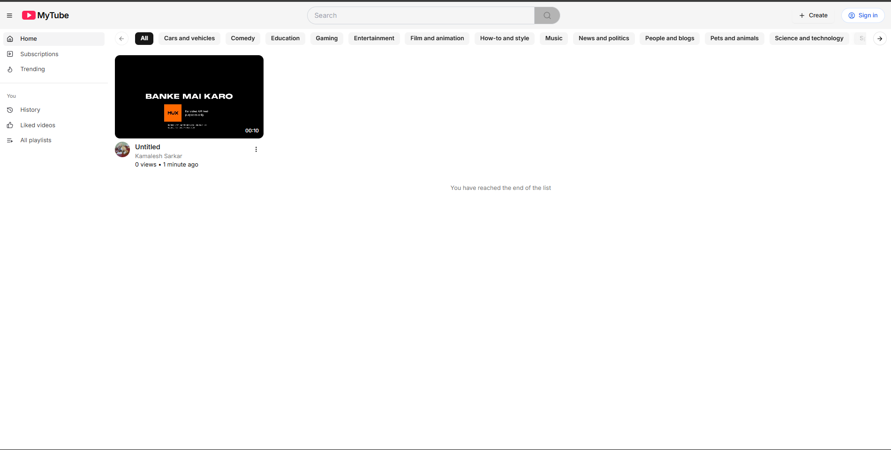
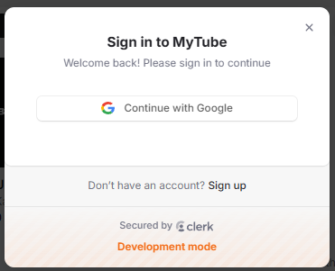
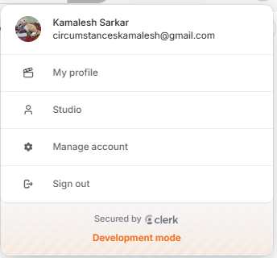

This is a [Next.js](https://nextjs.org) project bootstrapped with [`create-next-app`](https://nextjs.org/docs/app/api-reference/cli/create-next-app).

## Getting Started

First, run the development server:

```bash
npm run dev
# or
yarn dev
# or
pnpm dev
# or
bun dev
```

Open [https://new-tube-gamma.vercel.app] with your browser to see the result.

You can start editing the page by modifying `app/page.tsx`. The page auto-updates as you edit the file.

This project uses [`next/font`](https://nextjs.org/docs/app/building-your-application/optimizing/fonts) to automatically optimize and load [Geist](https://vercel.com/font), a new font family for Vercel.

## Learn More

To learn more about this project, take a look at the following resources:

## 01 Setup

- Configure environment
    - runtime (Node.js, Bun)
    - package manager (npm, pnpm, yarn, bun)

- Why bun?
    - You will get the same environment as I do some time
    - Easily run TypeScript scripts with ES6 imports
    - Less issues with dependency issues regarding React 19
        - (npm throws an error, yarn throws a warning, bun simply works)

- Establish basic Bun commands
    - bun add === npm install
    - bunx === npx

- Create Next.js project
    - use exact version
    - add shadcn/ui
    - get familiar with the structure

- Add usefull VSCode extensions

## 02 Basic layout


- Add logo asset
- Learn basic app router folders
- Sidebar components
    - Sidebar sections
    - Sidebar items
- Navbar
    - Search input
    - Sign in component

## 03 Authentication


- Integrate Clerk
- Add Sign in screens
- Add UserButton
- Add middleware
- Use auth state on sidebar sections
- Protect routers

## 04 Database setup

- Create a PostgreSQL database (www.neon.tech)
- Setup DrizzleORM
- Create users schema
- Migrate changes to database
- Learn how to use drizzle-kit

- Why DrizzleORM?
    - Only ORM with both relational and SQL-like query APIs
    - Serverless by default
    - Forcing up to "understand" our queries

```bash
cosnt result = await db.query.users.findMany({
    with: {  // prisma-like querying
    posts: true
    },
});
```
```bash
await db // sql-like querying
    .select()  
    .from(countries)
    .laftJoin(cities, eq(cities.countryId, countries.id))
    .where(eq(contires.id, 10))
```

## 05 Webhook sync

- Create ngrok account (or any other local tunnel solution)
- Obtain a static domain (not required, but easier development)
- Add script to concurrently run local tunnel & app
- Create the users webhook
- Connect the webhook on Clerk dashboard

## 06 tRPC setup

Why tRPC?
- end-to-end typesafety
- Familiar hooks (useQuery, useMutation etc.)
- v11 allows us to do authenticated prefetching

## 07 tRPC configuration

- Enable transformer on tRPC
- Add auth to tRPC context
- Add protectedProcedure
- Add rate limiting

## 08 Video Categories

- Create categories schema
- Push changes to the database
- Seed categories
- Prefetch categories
- Create categories components

## 09 Studio layout

- Create studio route group
- Create studio layout
- Protect studio routes