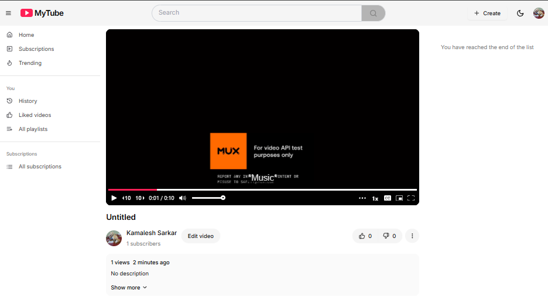
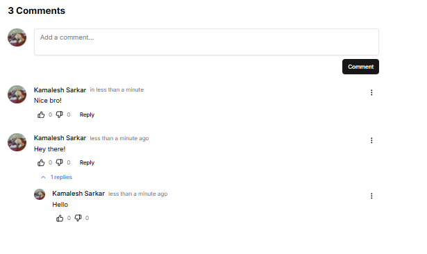
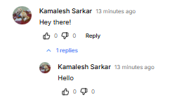
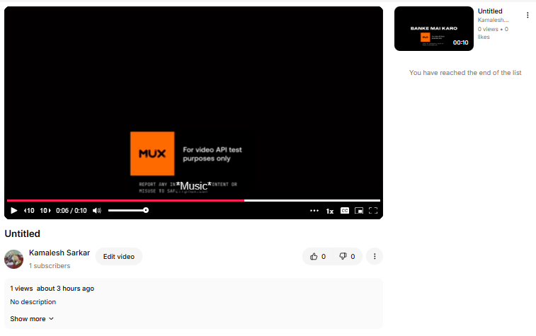
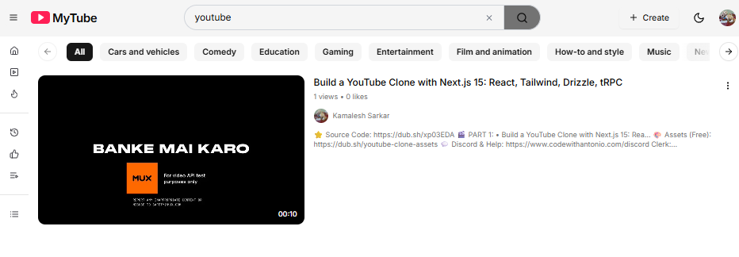
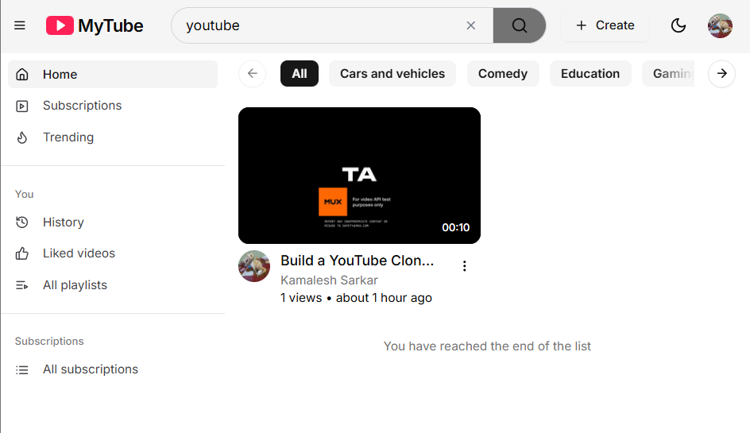

This is a [Next.js](https://nextjs.org) project bootstrapped with [`create-next-app`](https://nextjs.org/docs/app/api-reference/cli/create-next-app).

## Getting Started

First, run the development server:

```bash
npm run dev
# or
yarn dev
# or
pnpm dev
# or
bun dev
```

Open [https://new-tube-gamma.vercel.app] with your browser to see the result.

You can start editing the page by modifying `app/page.tsx`. The page auto-updates as you edit the file.

This project uses [`next/font`](https://nextjs.org/docs/app/building-your-application/optimizing/fonts) to automatically optimize and load [Geist](https://vercel.com/font), a new font family for Vercel.

## Learn More

To learn more about this project, take a look at the following resources:

## 01 Setup

- Configure environment
    - runtime (Node.js, Bun)
    - package manager (npm, pnpm, yarn, bun)

- Why bun?
    - You will get the same environment as I do some time
    - Easily run TypeScript scripts with ES6 imports
    - Less issues with dependency issues regarding React 19
        - (npm throws an error, yarn throws a warning, bun simply works)

- Establish basic Bun commands
    - bun add === npm install
    - bunx === npx

- Create Next.js project
    - use exact version
    - add shadcn/ui
    - get familiar with the structure

- Add usefull VSCode extensions

## 02 Basic layout


- Add logo asset
- Learn basic app router folders
- Sidebar components
    - Sidebar sections
    - Sidebar items
- Navbar
    - Search input
    - Sign in component

## 03 Authentication


- Integrate Clerk
- Add Sign in screens
- Add UserButton
- Add middleware
- Use auth state on sidebar sections
- Protect routers

## 04 Database setup

- Create a PostgreSQL database (www.neon.tech)
- Setup DrizzleORM
- Create users schema
- Migrate changes to database
- Learn how to use drizzle-kit

- Why DrizzleORM?
    - Only ORM with both relational and SQL-like query APIs
    - Serverless by default
    - Forcing up to "understand" our queries

```bash
cosnt result = await db.query.users.findMany({
    with: {  // prisma-like querying
    posts: true
    },
});
```
```bash
await db // sql-like querying
    .select()  
    .from(countries)
    .laftJoin(cities, eq(cities.countryId, countries.id))
    .where(eq(contires.id, 10))
```

## 05 Webhook sync

- Create ngrok account (or any other local tunnel solution)
- Obtain a static domain (not required, but easier development)
- Add script to concurrently run local tunnel & app
- Create the users webhook
- Connect the webhook on Clerk dashboard

## 06 tRPC setup

Why tRPC?
- end-to-end typesafety
- Familiar hooks (useQuery, useMutation etc.)
- v11 allows us to do authenticated prefetching

## 07 tRPC configuration

- Enable transformer on tRPC
- Add auth to tRPC context
- Add protectedProcedure
- Add rate limiting

## 08 Video Categories

- Create categories schema
- Push changes to the database
- Seed categories
- Prefetch categories
- Create categories components

## 09 Studio layout

- Create studio route group
- Create studio layout
- Protect studio routes

## 10 Studio videos

- Create videos schema
- Push database changes
- Create studio procedures
- Add vidoes records creations

## 11 Infinite loading

- Add suspense and error boundaries
- Create reuseable InfiniteScroll components
- Demonstrate infinite scroll

## 12 Mux integration


- Create a responsive dialog
- Create a free Mux account
    - Credit card NOT required!
- Get a 15-sec video with english audio
    - https://tinyurl.com/mytube-clip
- Create upload modal

Mux free account limitations

- Lenght limit (10s)
- Video deletion after 24h
- Mux watermark

You can add a credit card, and stay within free tier for the entirety of this project. You will unlock full benefits of Mux for $0

Mux pricing calculator: https://calculator.mux.com/

## 13 Mux webhooks
- Update video schema
- Push database changes
- Handle "video.asset.ready" events
    - assign thumbnail
    - assign preview
- Handle "video.asset.errored" events
    - update status
- Handle "video.asset.track.ready" events
    - delete from database
- Handle "video.asset.track.ready" event
    - update trackId and trackStatus

## 14 Video form


- Add skeleton to videos-section
- Create video form page
- Create video player
- Add ability to update video information
    - (Title, Description, Category, Visibility)

## 15 Video thumbnails


- Integrate uploadThink
- Add thumbnail upload functionality
- Add thumbnail restore functionality
- Refactor thumbnail field in the schema
    - Proper UploadThink cleanup

## 16 AI background jobs

Why background jobs?
- avoid timeout from long-running tasks
    - problematic with AI generations
- Ensure retries in case of failure

- Integrate Upstash workflow
- Trigger a background job
- Setup OpenAI SDK
    - Credit card required (No free trial, no free credits)
- Add background jobs
    - Generate title
    - Generate description
    - Generate thumbnail

## 17 AI thumbnails


- Create thumbnail prompt modal
- Create thumbnail generation workflow
- Add skeleton to form-section loading state

## 18 Video page


- Create video "getOne" procedure
    - Inner-join "user" (author information)
- Prefetching process
- Video section
- Comments section (Placeholder)
- Suggestions section (Placeholder)

## 19 Video views

- Create video views schema
- Combine video views for "getOne" videos procedure
- Create video views creation procedure
- Trigger video view creation on video play

## 20 Video reactioons

- Create video reactions schema
- Create video reactions for "getOne" videos procedure
- Create video reactions like & dislike procedure
- Connect VideoReactions component with new API

## 21 Subscriptions

- Create subscriptions schema
- Combine subscriptions for "getOne" videos procedure
- Create subscriptions procedures
- Connect Subscriptions procedures
- Connect SubscriptionsButton component with new API

## 22 Comments


- Create comments schema
- Create comments procedures
- Create comments section

## 23 Comments infinite loading

- Modify comments "getMany" procedure
- Chage prefetch() to prefetchInfifnite()
- Change suspense() to useSuspenseInfiniteQuery()
- Add InfiniteLoading components

## 24 Comments reactions


- Add "commentReactions" schema
- Create comment reactions UI
- Combine "commentReactions" with comments "getMany" procedure
- Add InfiniteLoading component

## 25 Comment replies


- Extend comment schema by adding "parentId" forein key
- Create UI for replies
- Modify comments "getMany" procedure by combining parentId
- Create variants for "CommentItem" component
- Create variants for "CommentForm" component
- Create CommentReplies component

## 26 Suggestions


## Compact VideoRowCard


- Suggestions
- Playlist items
- Small devices

## Regular VideoRowCard


- Search results
- Large devices

## VideoGridCard


- Feed grids
- Fallback for small devices

- Create suggestions procedure
- Prefetch suggestions
- Create VideoRowCard and VideoGridCard components
- Connect Suggestions section with new API

## 27 Search page


- Add manual video re-validation
    - in case webhook fail
    - in case wehook fire out of order
- Add proper categoryId query to procedure
- Create search procedure
- Create search page
- Prefetch search page
- Connect search section to API

## 28 Improvements

- Resolve complex "VERCEL_URL" env usage
- Fix unique constraint issue with manual video revalidation
- Add skeleton to search page
- Add default values to SearchInput component

## 29 Home feed


- Create videos procedures
- Add Home page
- Add Trending page
- Add Subscriptions page

## 30 Playlists

- Create playlists procedures
- Create History & Like videos pages

## 31 Custom playlists

- Create playlists schema
- Create playlists procedures
- Create playlists page

## 32 Populating playlists

- Create PlaylistAddModal component
- Create "getManyForVideo" playlist procedure
- Create add and remove procedures for playlists

## 33 Individual playlist

- Create "getVideos" procedure to load custom playlist's videos
- Builds custom playlist page
- Add ability to remove a video from a playlist

## 34 User page

- Add "bannerUrl" and "bannerKey" to user schema
- Create "users.getOne" procedure
- Modify "videos.getMany" procedure to accept userId prop
- Create userId page

## 35 Banner upload

- Implement "bannerUploader" in uploadthing/core.ts
- Create BannerUploadModal

## 36 Subscriptions list

- Create subscriptions "getMany" procedure
- Load recent subscriptions in sidebar
- Create all subscriptions page

## 37 Light & Dark theme setup

- Create a ThemeProvider component
- Wrape all elements between ThemeProvider in layout.tsx file
- Create a button to perform the task

## 38 Share component to share multiple platform

- Create a share component 
- Add social media platform
- Add a copy link button section

## 39 Remove from History

- Create protected procedure to delele watched video
- Create a one more procedure to delete all history 
- Create buttons to perform task

## 40 Clickable link in description 

- Create a function to find link and make it clickable
- You can use package or javascript function, I baically used JavaScript function

## 41 On delete video openModal 

- Create a Modal to ensure the deletion permission


## 42 Deplyment

- Fix build errors
- Deploy to Vercel (https://www.vercel.com)
- Fix environment variables
- Redeploy
- Test out the app

## Integrate CI-CD (GitHub Actions)

- Create a workflow in your root directory ( .github/workflows)
- Create a .yml file

And your project is ready. Enjoy it!
